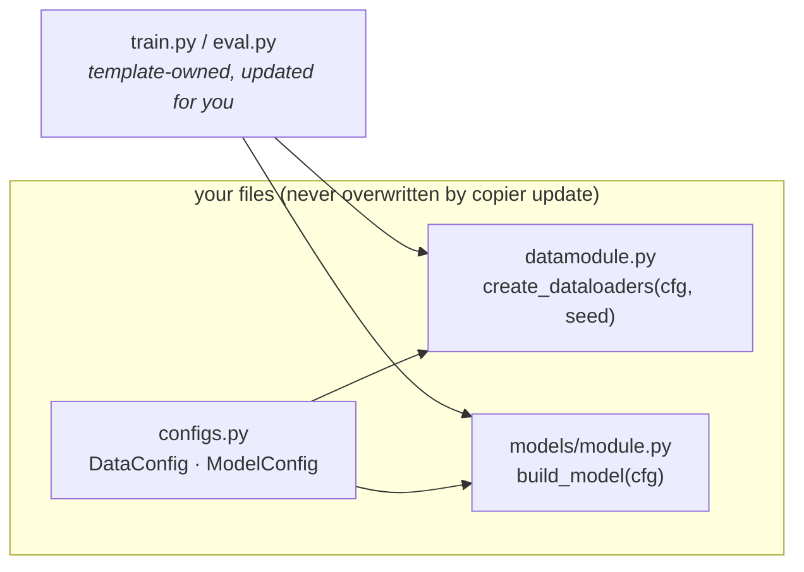

# Wine Quality — a complete `ml-research-template` walkthrough

This repo is the [15-minute tutorial](https://loevlie.github.io/ml-research-template/tutorial/)
of [ml-research-template](https://github.com/loevlie/ml-research-template), done for real:
generate a project, swap in a real dataset, train, evaluate, and finish with a
publication-grade number. **One commit per step**, so the whole walkthrough is readable
as diffs. Every output below is from an actual run of this code.

**▶ [Take the interactive walkthrough](https://loevlie.github.io/wine-quality-example/)** —
the same four steps as a scrollable code tour: each card lights up the exact
lines doing the work.

> **The result:** predicting red-wine quality from 11 physicochemical measurements
> ([UCI wine quality](https://archive.ics.uci.edu/dataset/186/wine+quality), 1,599 rows),
> the reference MLP reaches **0.621 ± 0.038** — mean validation accuracy over 5 seeds
> with a bootstrap 95% CI. Trains in seconds on a laptop CPU.

## The steps, as commits

| Step | Commit | What changed |
|---|---|---|
| 1 · Generate the project | [`822088c`](https://github.com/loevlie/wine-quality-example/commit/822088c) | `copier copy --trust gh:loevlie/ml-research-template wine-quality-example` — nothing hand-written yet |
| 2 · Wire in the data | [`2c6e6bc`](https://github.com/loevlie/wine-quality-example/commit/2c6e6bc) | `DataConfig` describes the dataset, `datamodule.py` loads it — the only two files you own for this |
| 3 · Name the experiment | [`8a02be5`](https://github.com/loevlie/wine-quality-example/commit/8a02be5) | The winning settings become `experiment=wine`, a preset in version control |

Read the step-2 diff first — it's the whole "bring your own data" story:
the entry points (`train.py`, `eval.py`) never change, because they only call
`create_dataloaders(cfg, seed)` and `build_model(cfg)`.



## Run it yourself

[uv](https://docs.astral.sh/uv/) is the only prerequisite.

```bash
git clone https://github.com/loevlie/wine-quality-example
cd wine-quality-example
uv sync --extra dev
uv run pytest                 # 22 smoke tests, ~5 s
```

The dataset (84 KB) downloads automatically on first use.

### Train

```bash
uv run python src/wine_quality/train.py trainer.max_epochs=30 run_dir=outputs/wine_first
```

```text
------------------------------------------------------------------------
run dir   outputs/wine_first
model     ExampleModel | 18,822 params | lr=0.0003
trainer   max 30 epochs | 32-true | seed=42
loss      SupervisedLossConfig | logger csv
config    outputs/wine_first/config.yaml (full snapshot + git state)
------------------------------------------------------------------------
Epoch   0 | train_loss=1.7181 | val_loss=1.5782 | val_acc=0.5486
Epoch   1 | train_loss=1.4662 | val_loss=1.3396 | val_acc=0.5643
...
```

Every run lands in its run dir with `config.yaml` (resolved config + git SHA +
the exact command — how you re-run this months later), `best.ckpt`, `last.ckpt`,
and `metrics.json`.

### Evaluate

The footer of every training run prints this command ready to paste:

```bash
uv run python src/wine_quality/eval.py ckpt_path=outputs/wine_first/best.ckpt
```

```text
eval: settings restored from outputs/wine_first/config.yaml
Eval | loss=0.9350 | acc=0.6489
```

The first line is the provenance snapshot doing its job — eval read the training
run's config (data path, model size, loss) instead of making you re-specify it.

### The publication-grade number

One seed is an anecdote. Five seeds and a bootstrap CI is a claim:

```bash
bash scripts/run_seeds.sh experiment=wine seeds="42,123,456,789,1337"
uv run python scripts/aggregate_seeds.py outputs/multi_seed_<stamp> --metric val/acc
```

```text
Metric: val/acc
Seeds:  [123, 1337, 42, 456, 789]
Mean:   0.6213
Std:    0.0379
95% CI: [0.5918, 0.6545]
```

That's the line for the paper: **0.621 ± 0.038 (5 seeds)**. When you have a baseline to
beat, run it with the *same seeds* and pass `--baseline` for the paired
significance test and effect size.

## Where this goes next

The [hands-on tour](https://loevlie.github.io/ml-research-template/tour/) continues
from exactly this point: grid sweeps, Optuna search, crash recovery, tracker
swapping, and a real paired significance test. Everything here also runs on SLURM
unchanged — see the [docs](https://loevlie.github.io/ml-research-template/).

To start your own project instead of cloning this one:

```bash
uv tool install copier
copier copy --trust gh:loevlie/ml-research-template my-project
```
